# US-International_DIY

Not revolutionary, but a much easier way to arrange an international layout on US keyboard than usual solutions. Especially for programmers.
  

## The story:

When inventing the Morse code, Samuel wondered what were the most used letters in order to match the alphabet to the code, the simplest for the most used. Then for the hesitations between two, the most visual, association of form or idea, simple memotechnical means.

These are the basics of mechanical writing. And this is what we are going to try to find, where we got lost, keeping this essential in mind and trying to avoid the pitfalls of other solutions that seem to be advantageous. And find there a certain joy of living without contradiction with efficiency.

Historically, this would have gone something like this:

If I add in 4 colors the most used letters, it gives this:

We see that to avoid distances, the letters were grouped on the same side, then, the least important of the most important, on the left, next to the capitals keys.

Of course in other languages, the letters FGB for example are more used, but overall the classification remains the same.

Now let's put them in order of importance, on a newer machine keyboard that requires less keystrokes and space, ergonomically; yes, we come from there; therefore eight fingers placed in a rounded shape on the middle line of the layout.

Which fingers are the most significant for each letter, balance of importance, ideas: the words east and noir.

Now the ease of access, to associate with which side for each pair and to the order of importance of the letters, which is: EARIOTNSLCUDMPHGBFYWKVXZJQ  
letter rather analytical  
Or letter rather synthetic  
Or balance of the weight

- Nowadays perhaps MP and HG would be interchangeable given that there is less space to cover and therefore less intellectualization of a vertical line change compared to a somewhat difficult finger advancement.
- This is the first draft of the qwerty/qwertz/azerty we know, some say one is scientific, the other universal, that's wrong, both are scientific and universal, the difference just depends on how the machine, and the need to adapt to avoid tiredness.

- The problems: (yes, we made this mistake again later) rather than punctuation and accentuation keys being on the same keys as the letters, we wanted them independent and easy to access, at least for the comma; the point only being placed at the end of the line. So the comma instead of the L and the point to its right. Also we could transfer the little used of X to the other side before the even less used Q.

Now all that remained was to make a weight balance and lighten the sentences, because there, it gave the impression that each letter had a break before the next.

But this research is dead, why? Let's crack the polemic, explain its impacts, then move on:
Some consciences; rather than making a comic of it, and leaving the fights to simple confrontations, which after all surviving was only a game which should have stopped depending on the consequences; invent wars, for the entities, as serious vs humor, laugh about something vs about someone etc., rather than a war in a comic. It's interesting, we don't have fun with, we overplay it, while they are simple contradictions for the humans. And we find ourselves almost forced to accept that they exist, and with, peace.
Not being here for this controversy, it is not mine and does not belong to me, moreover, to whom in fact?

But, and so,
- The F and T are exchanged according to the pi law of contradictions
- The R is removed from the word 'NOIR', The T is spaced from the word 'EAST'
- Some countries have shifted the comma, by lowering a letter, that of the little finger of the right hand, and surely the serious will explain in a fable by LaFontaine why it is not good for the monkey who played a trick on it.
- And the swap between L and N which isn't a bad idea, regrouping HJKL; place J, letter little used instead of N or L which were much more so.
etc.

On the other hand, the monotony is well broken, and the phonetics of the lines, easy to remember.

Then I'll do something else which will therefore be:
- How to keep the current layout, apart from simple changes concerning the letters.
- How to modify small errors.
- How to make innovative and simple, but not revolutionary nor reinvent the wheel, changes to accented characters.
- What a simple and effective placement concerning the other characters, and with what tools.
  

## Issues:

- And the current international US keyboard?

It has two major shortcomings, one it introduces the ALTGR key, which replaces the RIGHT ALT, which is not good for programmers or other trades; two, it causes an inability to simply use certain essential keys like ' or ".

- Anyone else built layouts based on the US International?

They use for example ALTGR to change ' (which therefore remains pleasantly usable) to make it an alternate key which works like on the unmodified international layout. But it's too complicated, still uses the right ALT key, and wants to adapt to all languages, which even if perfectly organized is a catch-all; rather than each doing their own, in a common idea to share and develop.

- And other famous layouts, Dvorak, Evolved, Capewell, Colemak, QFMLWY, QGMLWY, Norman, Arensito, Neo etc?

Precisely, for what is the template of a country, I am looking for more simpler, and modifiable by everyone according to their wishes, without contradicting the effectiveness of the base.

As for the others, they reinvent the wheel fake or not, which does not advance much except to do it, because it was enough to go back to the last stage of the current keyboard and make something of it.

- What about mechanical keyboards?

They do the job. The layout shouldn't be the essence of what they represent; they are part of a nice style like any other, but with the ability to be fully regrammable in the future, with less impact (ability to be wireless, great autonomy etc.). They will not be the only ones, so they represent a fashion, viable in the long term, but not a solution to a problem, what is ergonomics, efficiency and simplicity, regardless of the choice of type of keyboard, with each one's preferences, and not the keyboard type is the solution.
  

## 1. The choice of the keyboard

AINSI or ISO?

ANSI, American National Standards Institute on Microsoft Designer Compact Keyboard:
- VK_OEM_5 key above the Enter key, same size as Tab is good solution if you want enter accents from both hands, I will explain why later.

ISO, International Organization for Standardization on the same keyboard:
- But you can also directly take advantage of the additional key VK_OEM_102 of the ISO. Like Ctrl-X/C/V near little finger.

Mix on Acgam AG6X:

Mechanical, Membrane or Scissors?
- It's up to you. A good suitor if you don't want a mechanical keyboard for now: Logitech K230

Full-sized, 1800 Compact, 96%, Tenkeyless, 75%, 65%, 60% or 40%?
- It's up to you again.

In case of 1800 Compact, space between numpad and the rest or not?
- It depends. Space respect more syntetic and analitic differences, but it's less compact. So resect your brain. Don't choose too quickly.
  

## 1. My template and why

Ok, since template is broken, I'll start with AZERTY layout, for those personnal reasons (I've used a lot QWERTY too):
- All vowels are on the same line.
- It's sounds good, the sound is good.
- I don't like bad surprises, so this replaces CTRL+Q Quit by CTRL-Z Undo and CTRL+S Save with CTRL-Y Redo, and makes them more accessible.
- I can change WXCVBN to XCVWBN and get used to it, so when I'm on a misaligned keyboard, I don't have to do the split.
- I can change the logic of usual punctuation, perhaps later see for specific meaning like programmation.

  

## 2. Why the idea of ISO or MIX, and VK_OEM_5 same size as TAB?

- I want to avoid the use of the ALTGR key and keep the RALT key
- I don't want the current international US layout, because it makes it difficult to use some very useful keys
- I don't want solutions where the accents are made from other keys drawn with ALTGR (I may still want to keep; for example if I specifically use one language and want to keep access to other, I will talk about it later)

So I decided to use a specific accent key to enter accents for the language(s) that suits me, and everyone can make their own layout, with a simple, common template.
- Or I want both hands and use symetrical TAB and OEM_5 from ISO, and put TAB over CAPSLOCK.
- Or only one hand, and I put it over CAPSLOCK
- TAB key, is to facilitate access to the letters in a symmetrical way, it is not compulsory, we can keep this key in the current state.

I take an Example; imagine that I want to be able to write in French, Spanish and German very easily, without losing the functionality of essential keys.

First I consider the accents and additional characters I need:
- English: à - â - ä - é - è - ê - ë - î - ï - ô - ö - ù - û - ü - ÿ - ç
- Spanish: á - í - ó - ú - ñ - ¡ - ¿
- German: ä - ö - ü - ß

And I place them in a simple way on my template (do it with your own)

For my part,
- I put the acute accents on the letter,
- Then the grave just at the bottom right.
- Then we shift one letter and place the circumflex accent and the umlaut.
- I put I accents at the middle, but it remains very logical and memorizable.
- I cheat a little for the Y but that's okay, it's still fun.
- Now better to add colors instead of engrave them on the keys. I leave the characters but imagine that they are no longer there.

  

## 3. How to color and add characters on keys?

- In all cases accents places can be identified with backlight
- Order keys from a mechanical keyboard retailer
- Clear or Translucent keycaps, paint, sratch, then varnish
- Puding keycaps, markers, sratch, then varnish
- Ink and laser pointer
- Paint or acrylic markers then varnish
- Thermal transfer
- Classic transfer and strong glue (Avoid stickers)

Fluorescent paint possible if not using backlight
  

## 4. Full template

Now it's time to complete what we do with the normal keys and with the yellow keys.
- I exchange on this occasion the buttons [{ , ]} and -_ , =+
- I invert [{ , ]} into {[ , }] and =+ into +=
- I split Quotes ' " so I put *⁎ there instead, and since ? is already on the bottom line, I made ?/ the /\ key

Of course it's as you wish.

I removed color of the last O accent, Öö for visibility.

  

## 5. What does 'Unicode (menu)' mean?

This key will be assigned to the 'Menu' key (right click)
But I created a separate project named RALTUnicode to easily grab pre-determined lists of unicode characters:
https://github.com/ytyra/RALTUnicode

And 'Menu' will be used to launch this Unicode manager.
  

## 6. What about the 'Characters' under accents?

Although I'm using RALTUnicode, what about using the 'Accents' key for a second function

So I chose to use it as a way to write the most common characters; by pressing the SHIFT-YELLOW key (CAPSLOCK or TAB + VK_OEM_5 depending on what you have chosen)

My choice:

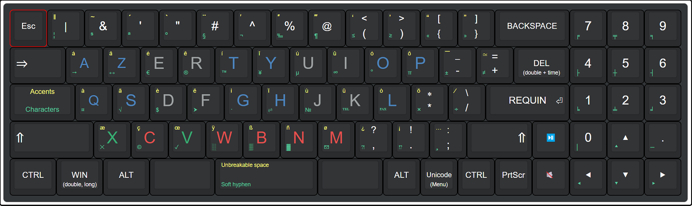
  

## 7. Could I write all accents?

Two choices, either use RALTUnicode,
https://github.com/ytyra/RALTUnicode

Or use dead keys.

A good way to do this is not to use the key itself, like the traditional US international does, because there's a lot of co-binding when your regular key acts as a dead key.
- For example, if you want to do all acute with ´ don't use SHIFT-', use CTRL-SHIFT-' instead
- For base codes use for example numbers, because it's not allowed to use a base charcater after non breakable space.
- Place the others on revelant keys.

So:
- This means you can write any accented letter, by doing CTRL+SHIFT+Accent place+Letter.
- The ligatures of the fonts that support them are obtained by doing CTRL+SHIFT+Accent place+Space.
- Or simply write the desired accent, by doing CTRL+SHIFT+Accent+Accent

Here is a table of all common acctents and how associate them:

| CTRL+SHIFT+Key | Name         | Second key                | Gives :                   | Accent    | Ligature |
|:--------------:|:------------:|:-------------------------:|:-------------------------:|:---------:|:--------:|
|   1  ( \|‖  )   | macron       | aeiou AEIOU               | āēīōū ĀĒĪŌŪ               |     ¯     |  U+0304  |
|   2  ( &~  )   | tilde        | aionu AIONU               | ãĩõñũ ÃĨÕÑŨ   	        |     ~     |  U+0303  |
|   3  ( '´  )   | acute        | aceilnorsuyz ACEILNORSUYZ | áćéíĺńóŕśúýź ÁĆÉÍĹŃÓŔŚÚÝŹ |     ´     |  U+0301  |
|   4  ( "`  )   | grave        | aeiou AEIOU               | àèìòù ÀÈÌÒÙ               |     `     |  U+0300  |
|   5  ( #¨  )   | diaeresis    | aeiouy AEIOUY             | äëïöüÿ ÄËÏÖÜŸ             |     ¨     |  U+0308  |
|   6  ( ^′  )   | circumflex   | aceghijosu ACEGHIJOSU     | âĉêĝĥîĵôŝû ÂĈÊĜĤÎĴÔŜÛ     |     ^     |  U+0302  |
|   7  ( %″  )   | stroke       | bcdehiloty BCDEHILOTY     | ßȼđɇħijłøŧɏ ẞȻĐɆĦIJŁØŦɎ     |   U+00AD  |  U+0337  |
|   8  ( @‴  )   | ring         | au AU                     | åů ÅŮ                     |     ˚     |  U+030A  |
|   9  ( (‘< )   | breve        | agu AGU                   | ăğŭ ĂĞŬ                   |     ˘     |  U+0306  |
|   0  ( )’> )   | caron        | cdeilnrstz CDEILNRSTZ     | čďěǐľňřšťž ČĎĚǏĽŇŘŠŤŽ     |     ˇ     |  U+030C  |
|   -  ( {“[ )   | double acute | dout DOUT                 | ðőűþ ÐŐŰÞ                 |     ˝     |  U+030B  |
|   +  ( }”] )   | double grave | aeioru AEIORU             | ȁȅȉȍȑȕ̏ ȀȄȈȌȐȔ             |     ˵     |  U+030F  |
|   ,  ( ,?  )   | ogonek       | aeiu AEIU                 | ąęįų ĄĘĮŲ                 |     ˛     |  U+0328  |
|   .  ( .!  )   | dot          | cegilz CEGILZ atAT        | ċėġıŀż ĊĖĠİĿŻ ȺȾ          |     ˙     |  U+0307  |
|   ;  ( ;:  )   | cedilla      | cgklnrst CGKLNRST         | çģķļņŗşţ ÇĢĶĻŅŖŞŢ         |     ¸     |  U+0327  |

CTRL should not be used on letters and numbers, better use CTRL+SHIFT.

As we are only entitled to 11 dead keys, I remove some accents already set with the first, then I simplify

This gives an array that I place on the keys |&'"#^%@(), putting the numbers 1234567890 as the base (this can be used in case of absence or Other use of the numpad, like macropad).

| CTRL+SHIFT+Key | Name            | Second key                    | Gives :                       | Base |
|:--------------:|:---------------:|:-----------------------------:|:-----------------------------:|:----:|
|      \|‖        | macron          | aeiou AEIOU                   | āēīōū ĀĒĪŌŪ                   |  1   |
|      &~        | tilde           | aionu AIONU                   | ãĩõñũ ÃĨÕÑŨ   	              |  2   |
|      '´        | double, acute   | acdeilnorstuyz ACDEILNORSTUYZ | áćðéíĺńőŕśþűýź ÁĆÐÉÍĹŃŐŔŚÞŰÝŹ |  3   |
|      "`        | double grave    | aeioru AEIORU                 | ȁȅȉȍȑȕ̏ ȀȄȈȌȐȔ                 |  4   |
|      #¨        | ogonek, cedilla | aegiklnrstu AEGIKLNRSTU       | ąęģįķļņŗşţų ĄĘĢĮĶĻŅŖŞŢŲ       |  5   |
|      ^′        | circumflex      | aceghijosu ACEGHIJOSU         | âĉêĝĥîĵôŝû ÂĈÊĜĤÎĴÔŜÛ         |  6   |
|      %″        | stroke          | abcdefhiloty ABCDEFHILOTY     | ȺßȼđɇŧħijłøȾɏ ȺẞȻĐɆŦĦIJŁØȾɎ     |  7   |
|      @‴        | dot, ring       | acegiluz ACEGILUZ             | åċėġıŀůż ÅĊĖĠİĿŮŻ             |  8   |
|      (‘<       | breve, caron    | acdegilnrstuz ACDEGILNRSTUZ   | ăčďěğǐľňřšťŭž ĂČĎĚĞǏĽŇŘŠŤŬŽ   |  9   |
|      )’>       |                 |                               |                               |  0   |

And I complete each with all the letters, otherwise for example for CTRL-SHIFT-^-c we have ĉ but for CTRL-SHIFT-^v we get 6v.
  

## 8. And technically, how do I do?

Ok, I take a practical case.

In my example,
- I swap [{ ]} to -_ =+
- Then I permute to {[ }] -_ and +=

If you have a mechanical keyboard that supports firmware like QMK, VIA and so on...you will be able to do both with it and use it on any other computer.

If you only have a simple programmable keyboard, it's really better to swap the keys, even if you use a layout to permute, then on another device without your template, you will be less lost.

If you have none of both, try SharpKeys (see links at the end), it's very easy to use and account dependant
- You will need to log out and log back in to make your decisions active.
- No need to follow the route, just which one and by what.
- Don't worry about loops, only the original keys are reassigned. Changes will not affect an already reassigned key.

Then, for example:
- Open SharpKeys
- Click Add
- Select or type Key: -_ (00_0C) under 'Map this key'
- Select or type Key: [{  (00_1A) under 'To this key'
- Click 'OK'
- Check that it has been added to the list and that it is the correct assignment
- Click 'Write to Registry' and valid 'OK'
- LogOut/ReLog
The Key -_ should act now like [{, not the characters, it will be detected as a raw [{ key, then we can change characters, it will stay detected as it is.

Of course a fully reprogrammable keyboard is preferable, but it remains a viable solution on his workstation with another keyboard for example, or for a tiny budget.

Then use Microsoft Keyboard Layout Creator (see links at the end) to make a layout.
- Either use the one I provide and modify it before as you see fit.
- You will find many examples and tutorials.

First if you use a layout, take the same base as your Keyboard, US QWERTY layout in my case with the Redragon. Change the layout by permuting letters on the keyboard with its software or Sharpkeys. Not in the layout.

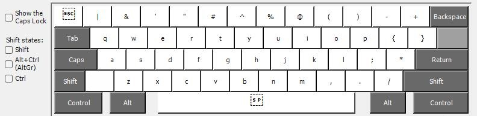

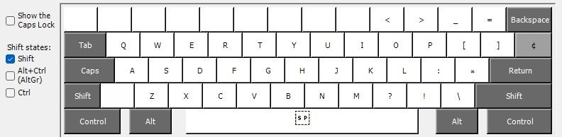

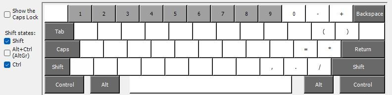

Nothing under Control and AltGr

If you prefer to use Autohotkey rather than a layout, I suggest you use F13-F24 for example for your special keys, it's easier to make combinations.
- If you wanty two yellows then use two differents keys, and therefore equal in accents, but different in what they do with a character key or a double tap.
- Or simply ignore yellow keys and directly long press for accents. And do something else with those keys, or leave them as they are.

The advantage of Autohoykey is to not depend of any dead key, so no suprise.
- You can modify your keys to hardware unused keys, like sc055, sc059 etc, and use them in your script, and be layout independant, just the need of your script, which runs without installation. Even on another computer if you have a reprogrammable keyboard.
- You can run a timer for sepcial keys, so it has the adventage of dead keys, (not have to stay pushed for a combo) but not the inconvenient to have to do a false character if you type on it by mistake.
  

## 9. And if I want to use characters on ALTGR for the layout?

If you absolutely want to use characters on ALTGR, without having to sacrifice RALT for ALTGR and manually type LEFT CONTROL + RIGHT ALT (Which is a good way to keep keys safe since the combination is hard to make by chance), it is normally impossible because as soon as placed, a character on the altgr layout, it locks the template to replace RALT, and it is not possible to unlock it manually.

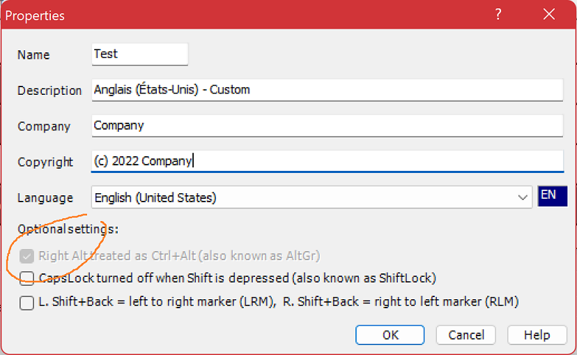

But there is a trick.
- Continue until the end, save your template regularly, then compile it as is.
- Once done, in the installation directory go to the directory that corresponds to your machine, or else, do it for all.
- Open the dll you find there with a hex editor.
- Look for 01 as in the image below (the group that contains it, which can be seen in the image, is easily identifiable; even if the whole file may be different)
- Change it to 00 then save.
- And only now proceed with the installation using the setup.exe from the root directory.

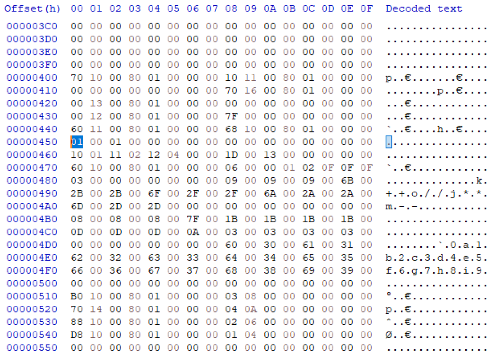

Normally if everything went well, the RALT key is not modified, but you can use LCTRL + RALT to enter the characters corresponding to this layout.
  

## 10. Special features

I provide some other tricks which you will find in my sample autohotkey file

I make the keyboard settings then I put the menu key on the function key at the end. Also for some functions I use RCTRL key as function key.

Shortcuts:
- Fn-ESC > ALT-F4
- Fn-Unicode > F12
- Fn-Numpad > F1-F11
- Fn-Arrows > PgUp, PgDown, Home, End
- Fn-PLAY/PAUSE > VOL+
- MUTE > VOL-
- Fn-PRTSCR > STOP

Tricks:
- Double PLAY/PAUSE is NEXT but stay instant
- Double MUTE is PREVIOUS but stay instant
- Simple WIN do nothing, long WIN activate WIN, double WIN show win menu
- Simple DEL do nothing, except if it's already activated by Double DEL, but for a short time

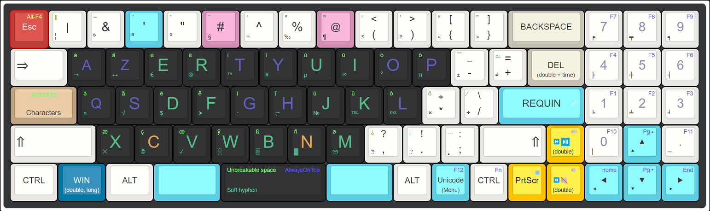
  

## 11. Tests

- I take a Redragon K628 PRO / Redragon K626P-KBS / Nuphy Air 96
- I take everything apart
- I add a switch to the back right, for easy on/off while I can let 2.4G below the case
- I buy Lanzhd 3.7V 5400Mah / 4000Mah lithium polymer rechargeable battery
- I add a battery protection plastic plate and do exchange
- I put foam pad inside the bottom case
- I add Silicone o-ring to make a gasket mount and level up a little the top case to let battery have some space
- I adjust the cutout of the location of the usb port in the case to make it coincide again with the PCB
- I add Switch Pads PORON EVA PE Foam Stickers, to absorb contact between switches and PCB
- I put sound absiorbing High density foam between PCB and top case, cuted inside one piece
- I paint the inside of the top case white in white (better at rear of the switches)
- I take Mid Profile / Low profile switches and different types of springs
  - Example, not definitive:
  - clicky hard for ESC ans PRINTSCREN
  - tactile hard for WIN, UNICODE
  - tactile medium for PLAY/PAUSE, MUTE
  - tactile low for numpad
  - linear hard for BACKSPACE, DEL, ENTER, TAB, ARROWS
  - linear medium for upper row, yellow key (capslock) and -+*/,.;
  - linear low for all others
- I buy Gazzew Bobagum, use silent system to transfer them to the GMTX, no shock on ascent
  - or I use Super glue Flex with cut mini foams, or very good quality synthetic fiber
- I put some synthetic fiber in the hole of each, no shock downhill
- I buy several keycaps sets, I keep those that organise well the keyboard plan
  - including a set of shinethrough to color the accents, but only these keys to not overuse the battery
- I file and adjust the height or use nsa
- I put a thin layer of Medium density foam, using a Hole Puncher, in the bottom of the keycaps

Then,
- I program
- I do layout
- I write Autohotkey script

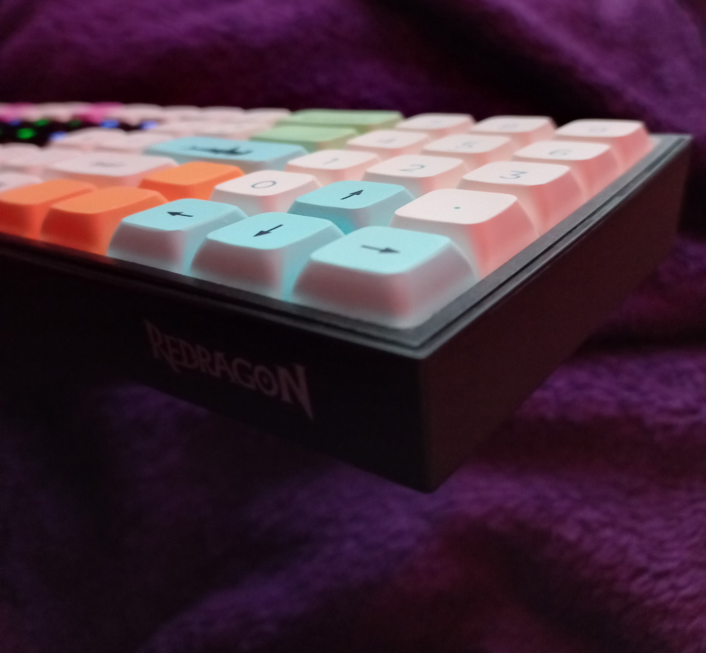

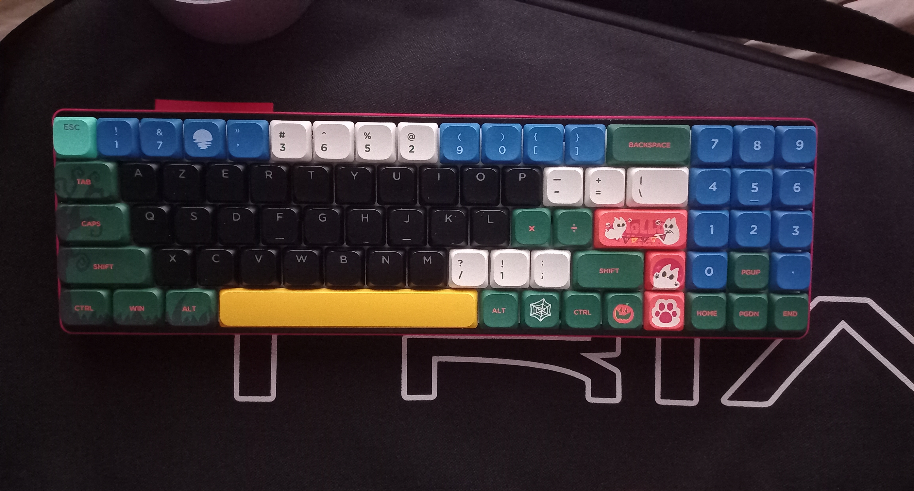
  

## 12. Redragon and Nuphy

You can manually edit the Cfg.ini of the respective directories from C:\Program Files (x86)

With redragon's you can even modify the function layer

K+number correspond to the physical key of your keyboard

Then codes:
see Redragon-Nuphy codes.txt

Backup your original file before

Modify, launch program and do restore

For Nuphy you can try this:
https://github.com/donn/nudelta

## 13. After tests

It works as expected, it's simple and fun.

I prefer to use the long press Autohotkey method, but it has latency that reverses the letters if you type too quickly, so I use CAPSLOCK as a dead key.

Combining programmable + layout for dead keys and permutations + Autohotkeys fo scripting is the best.
- Except with QMK VIA but find a hardware with a firmware like ZMK that supports 2.4G instead of bluetooth is extremely rare.
- Then you can use Mod-Tap Tap Dance etc. functions of QMK, VIA etc. to replace Autohotkey to send unicode.

## 14. Show case

The keys and location do not all correspond to those I currently use, it's just to give ideas.

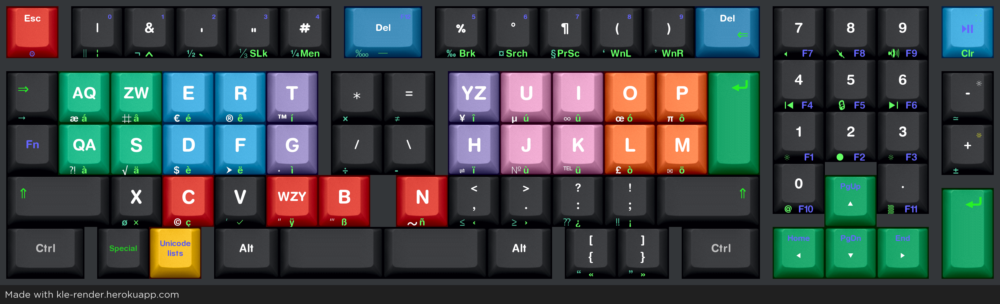

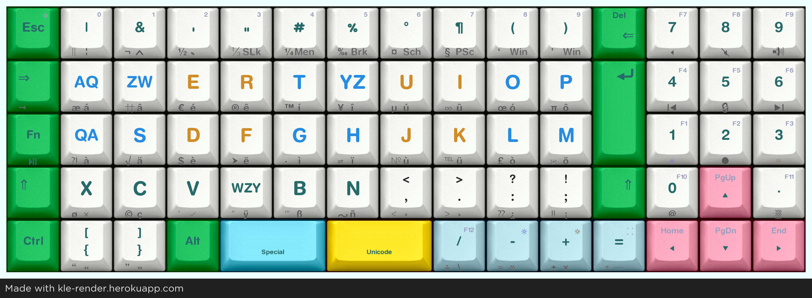

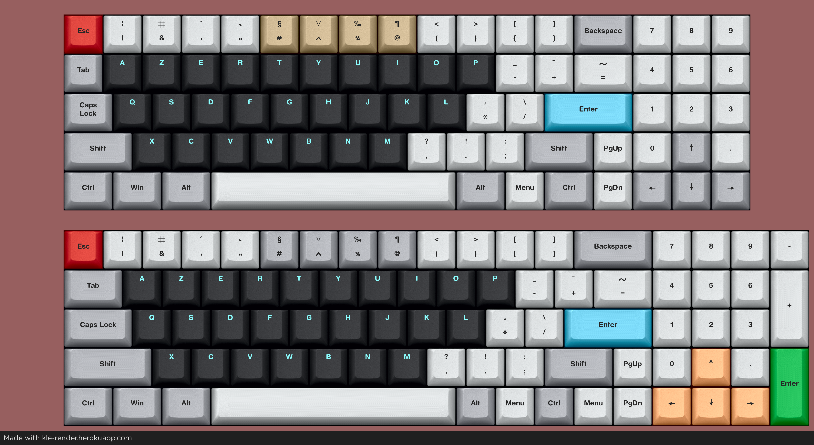

  

## Related links and source

RALTUnicode:
https://github.com/ytyra/RALTUnicode

KLE:  
http://www.keyboard-layout-editor.com

KLE-Render:  
https://kle-render.herokuapp.com

QMK Firmware:  
https://qmk.fm

ZMK:  
https://zmk.dev

VIA:  
https://www.caniusevia.com

Microsoft Keyboard Layout Creator (MSKLC):
https://www.microsoft.com/en-us/download/details.aspx?id=102134

SharpKeys:  
https://github.com/randyrants/sharpkeys

Physical Keyboard Layouts Explained In Detail:  
https://drop.com/talk/947/physical-keyboard-layouts-explained-in-detail

The frequency of the letters of the alphabet in English:  
https://www3.nd.edu/~busiforc/handouts/cryptography/letterfrequencies.html

US Multilingual Keyboard Layout:  
https://www.brianhetrick.com/kb
