# DIY-US-INTL-Keyboard

Not revolutionary, but a much easier way to arrange an international layout on US keyboard than usual solutions. Especially for programmers.
  

## The story:

When inventing the Morse code, Samuel wondered what were the most used letters in order to match the alphabet to the code, the simplest for the most used. Then for the hesitations between two, the most visual, association of form or idea, simple memotechnical means.

These are the basics of mechanical writing. And this is what we are going to try to find, where we got lost, keeping this essential in mind and trying to avoid the pitfalls of other solutions that seem to be advantageous. And find there a certain joy of living without contradiction with efficiency.

Historically, this would have gone something like this:

If I add in 4 colors the most used letters, it gives this:

We see that to avoid distances, the letters were grouped on the same side, then, the least important of the most important, on the left, next to the capitals keys.

Of course in other languages, the letters FGB for example are more used, but overall the classification remains the same.

Now let's put them in order of importance, on a newer machine keyboard that requires less keystrokes and space, ergonomically; yes, we come from there; therefore eight fingers placed in a rounded shape on the middle line of the layout.

Which fingers are the most significant for each letter, balance of importance, ideas: the words east and noir.

Now the ease of access, to associate with which side for each pair and to the order of importance of the letters, which is: EARIOTNSLCUDMPHGBFYWKVXZJQ  
letter rather analytical  
Or letter rather synthetic  
Or balance of the weight

- Nowadays perhaps MP and HG would be interchangeable given that there is less space to cover and therefore less intellectualization of a vertical line change compared to a somewhat difficult finger advancement.
- This is the first draft of the qwerty/qwertz/azerty we know, some say one is scientific, the other universal, that's wrong, both are scientific and universal, the difference just depends on how the machine, and the need to adapt to avoid fatigue.

- The problems: (yes, we made this mistake again later) rather than punctuation and accentuation keys being on the same keys as the letters, we wanted them independent and easy to access, at least for the comma; the point only being placed at the end of the line. So the comma instead of the L and the point to its right. Also we could transfer the little used of X to the other side before the even less used Q.

Now all that remained was to make a weight balance and lighten the sentences, because there, it gave the impression that each letter had a break before the next.

!!!! WE CAN CONSIDER this research for later when we are sure that our keyboards are fully programmable and can be used on any device without having to put a layout template file (which requires admin rights ) or whatever else to get it to work properly, because the whole layout is a heavy thing to swap out.

In the meantime, I will rather dwell on other errors that have been made, and see if there are no other solutions than those usually proposed and which come out of the controversy.

But first, crack the polemic, explain its impacts, then move on:

Some consciences,

Rather than making a comic of it, and leaving the fights to simple confrontations, which (, if we are not in need, which should not have been the case apart from surviving, all, on this planet) was only a game, which should have stopped depending on the consequences (with a little wisdom or cold blood and not after 400,000 years of butchery),

Invent wars, for the entities, as serious vs humor, rather than a war in a comic strip, it's interesting, we have fun with it as we don't, we play it, while they are simple contradictions for the human. And we find ourselves almost forced to accept that they exist, and with that peace (yes, if you don't want war to exist as a real concept, it's because you believe it exists and you flee her in peace) and with that the emancipation and with that the relentlessness that would project a war on her that would remain only hers, yes, the war, a simple idea, apart from the consequences.

Which means that in the fun of the "morons" who would project according to some who speak of others, who exist for those, who are for them, free from what did not exist, to make war, peace, to laugh, to make others project, are in their sprinkler mirror sprinkled, to go with the theme of the first typewriters in Chaplin's time; rather again, it's the content of a comic book; well it turns out that to believe themselves free, the serious ones rage with their own fun on them to want to reinvent the wheel again and do better than what we had for which they would be responsible for its destruction. Yes, they were better than nobody who can't have done what doesn't exists. Except consequences, and fighting was just a game at the origin of the times.

And so,
- The F and T are exchanged according to the pi law of contradictions
- The R is removed from the word 'NOIR', The T is spaced from the word 'EAST'
- Some countries have shifted the comma, by lowering a letter, that of the little finger of the right hand, and surely the serious will explain in a fable by LaFontaine why it is not good for the monkey who played a trick on it.
- And the swap between L and N which isn't a bad idea, regrouping HJKL; place J, letter little used instead of N or L which were much more so.
etc.

On the other hand, the monotony is well broken, and the phonetics of the lines, easy to remember.

Not being here for this controversy, it is not mine and does not belong to me, moreover, to whom in fact?

I'm not saying that to do it, but that it won't be my subject, I'll do something else.

Which will therefore be: How to keep the current layout, apart from simple changes concerning the letters. How to remodify small errors such as the comma instead of M. How to make innovative and simple, but not revolutionary nor fun to reinvent the wheel, changes to accented characters. What a simple and effective placement concerning the other characters, and with what tools.
  

## Issues:

- And the current international US keyboard?

It has two major shortcomings, one it introduces the ALTGR key, which replaces the RIGHT ALT, which is not good for programmers or other trades; two, it causes an inability to simply use certain essential keys like ' or ".

- Anyone else built layouts based on the US International?

They use for example ALTGR to change ' (which therefore remains pleasantly usable) to make it an alternate key which works like on the unmodified international layout. But it's too complicated, still uses the right ALT key, and wants to adapt to all languages, which even if perfectly organized is a catch-all; rather than each doing their own, in a common idea to share and develop.

- And other famous layouts, Dvorak, Evolved, Capewell, Colemak, QFMLWY, QGMLWY, Norman, Arensito, Neo etc?

Precisely, for what is the template of a country, I am looking for more fun and simpler, and modifiable by everyone according to their wishes, without contradicting the effectiveness of the base.

As for the others, they reinvent the wheel in a fake fun, which does not advance much except to do it, because rather than presenting each his own, it was enough to go back to the last stage of the current keyboard and make something of it.

Basically, they want you make do this:

That is to say, that the base having been used for the development of the QWERTY, it is placed on the QWERTY in an inappropriate way since this was done for machines having a lot of space between each key and requiring a lot of force to typing, which is not the case with our keyboards, which therefore deserve a layout that stems from it and not a layout that reinvents it where it is not suitable. On the other hand, a keyboard resembling a typewriter, there are some magnificent ones today.

That's why I'm not going to do it, I'll wait for fully reprogrammable keyboards without wandering in autonomy, then I'll do my own. But if some people do it for themselves, and they like it, or some people do it in a global way without trying to reinvent the wheel, so much the better for them. Only it remains hard to pass from a computer which is his to one which is not.

- What about mechanical keyboards?

They do the job. The layout shouldn't be the essence of what they represent; they are part of a nice style like any other, but with the ability to be fully regrammable in the future, with less impact (ability to be wireless if needed, great autonomy etc.). They will not be the only ones, so they represent a fashion, viable in the long term, but not a solution to a problem, what is ergonomics, efficiency and simplicity, regardless of the choice of type of keyboard, with each one's preferences, and not the keyboard type is the solution.
  

## Disclaimer:
I don't have a budget, so the example will be basic, but it's the idea that counts, afterwards, everyone adapts if they want.

But I will provide software solutions
  

## 1. The choice of the keyboard
Remember, I'm not substituting my choices for yours, I'll explain mine and how I adapt them, then you can make your own and possibly use my ideas to put them into practice.

AINSI or ISO?

ANSI, American National Standards Institute on Microsoft Designer Compact Keyboard:

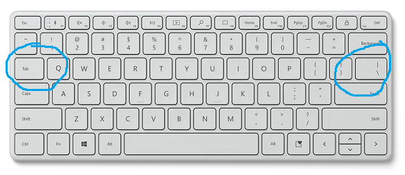

ISO, International Organization for Standardization on the same keyboard:

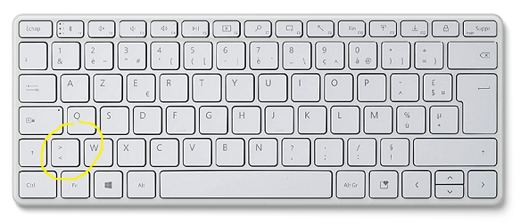

- For my project I need the VK_OEM_5 key above the Enter key, same size as Tab. I will explain why later. You may also want to, or not, and in some situations prefer other things, I also explain which ones and how.
- But you can also directly take advantage of the additional key VK_OEM_102 of the ISO. Personally, I'll use it if it's there, but I can also place it elsewhere, which in fact I prefer. I'll explain how and what to do with it.

Mix on Acgam AG6X and TedGem:

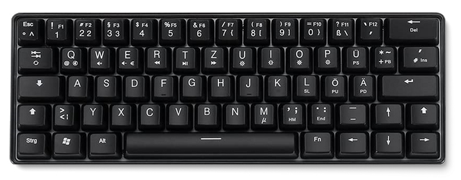

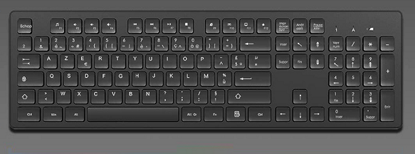

- So I'm going to prefer the ANSI standard or a MIX, we'll see if you too, or if other choices are possible, or go back to other more classic but less simple projects.
- Mechanical, Membrane or Scissors? It's up to you. Since mechanical costs a lot, I'll go on classical membrane to test, cause I love heavy touches. And I wait for fully reprogrammable ones to made changes possibles to easily use it on different computers hoping for less consumption. Membrane can last for two years with a single battery, I hope for one month with light backlight when I need it.

Two good suitors: Logitech K230 and X9 Performance 102-key Wireless

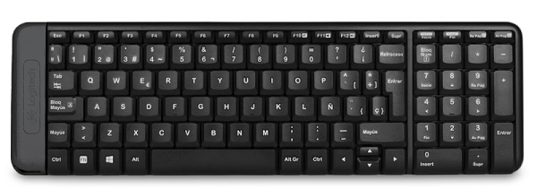

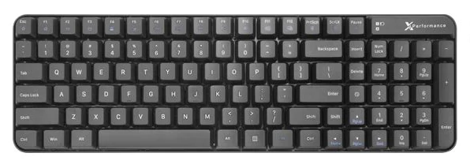

- Full-sized, 1800 Compact, 96%, Tenkeyless, 75%, 65%, 60% or 40%? It's up to you again. Personally, I'll speak of Compact and 75%, But you can adapt.
- In case of 1800 Compact, space between numpad and the rest or not? It depends. Space respect more syntetic and analitic differences, but it's less compact. So if you do it more compact, you have to find another way to separate theme resecting your brain. Thinking again with scientific and universal and simple. It seems that offsetting the arrow keys and painting them another color is the easiest way. And be careful, again, some have forgotten why we did it, and therefore do it without painting the keys, which makes it difficult to use, much more than separated, or else, they do it by design, like the jumper headless, including minus numpad, on keyboards smaller than 75% or Tenkeyless.

Therefore, a 75%, a Compact, which respects the separation, or a separate Compact.

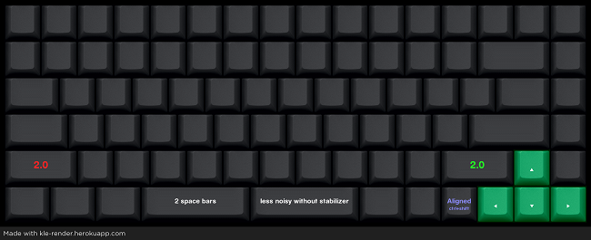

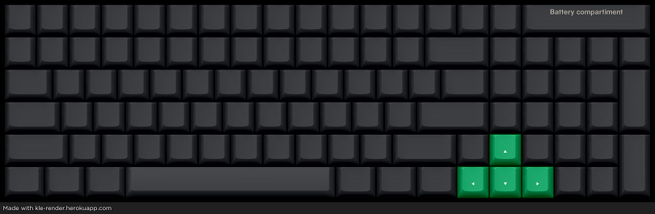

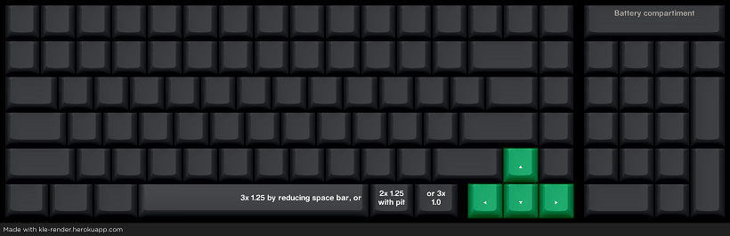
  

## 1. My template and why

Ok, since template is broken, and fully programmable keyboards are rares (except for the 60%) or don't offer all I need for now, I'll start with AZERTY layout, for those personnal reasons (I've used a lot QWERTY too):
- All vowels are on the same line.
- It's sounds good, the sound is good.
- I don't like bad surprises, so this replaces CTRL+Q Quit with CTRL-Z Undo, and CTRL+S Save with CTRL-Y Undo, and makes them more accessible.
- I can change WXCVBN to XCVWBN and get used to it, so when I'm on a Misaligned keyboard, I don't have to do the splits, except to have fun doing it.
- I could invert J and L later, without alterate my choice.

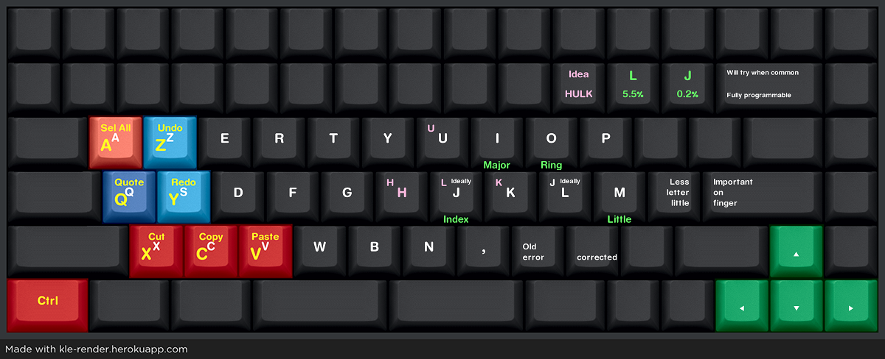
  

## 2. Why ISO or MIX, and why VK_OEM_5 same size as TAB?

- I want to avoid the use of the ALTGR key and keep the RALT key
- I don't want the current international US layout, because it makes it difficult to use some very useful keys
- I don't want solutions where the accents are made from other keys drawn with ALTGR (I may still want to keep; for example if I specifically use one language and want to keep access to other ; the possibility of other accents but in a grouped and more explicit way, I will talk about it later)

So I decided to use this key, VK_OEM_5, and make it an accent key for the language(s) that suits me, and everyone can make their own layout, with a simple, common template.

The fact of also using the TAB key, is to facilitate access to the letters in a symmetrical way, it is not compulsory, we can keep this key in the current state.

I told you that I don't like bad surprises like Numlock etc, well they find that I don't like Caps Lock either, so I move the TAB to Caps Lock, but everyone does what they want. Just, I throw the idea, it's up to you if it's the right one or you find a better one.

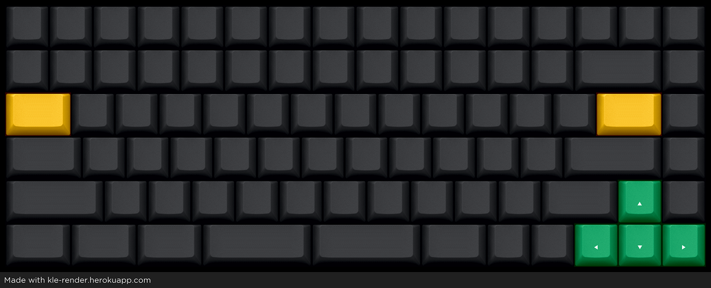

I take an Example; imagine that I want to be able to write in French, Spanish and German very easily, without losing the functionality of essential keys. First I consider the accents and additional characters I need:
- English: à - â - ä - é - è - ê - ë - î - ï - ô - ö - ù - û - ü - ÿ - ç
- Spanish: á - í - ó - ú - ñ - ¡ - ¿
- German: ä - ö - ü - ß

And I place them in a simple and clever way on my template (do it with your own)

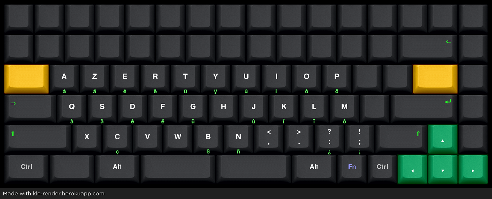

For my part, I put the acute accents on the letter, then the grave just at the bottom right. Then we shift one letter and place the circumflex accent and the umlaut. For the U, we move back two squares instead, but it remains very logical and memorizable. When at I we cheat a little, like a Tetris, but that's okay, it's still fun. CBN?! additional ones are obvious.

Note that I take advantage of the move of the M to reorganize the punctuation marks, it is not mandatory, but I might as well take advantage of it.

Now better to add colors instead of engrave them on the keys. I leave the characters but imagine that they are no longer there.

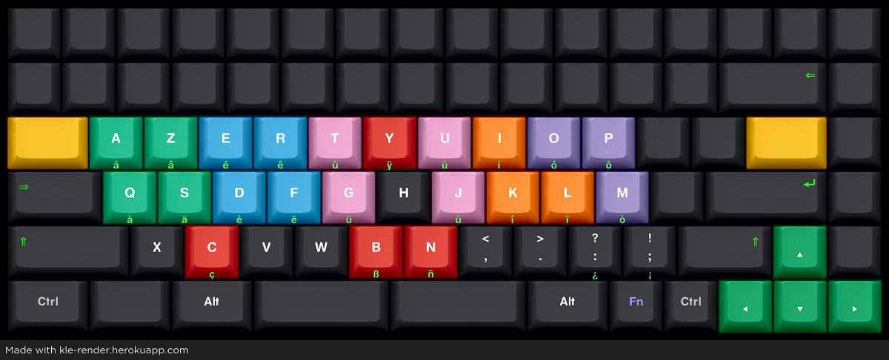

Possibly just on the edges, so as not to mix with the special keys and not to overload the keyboard.

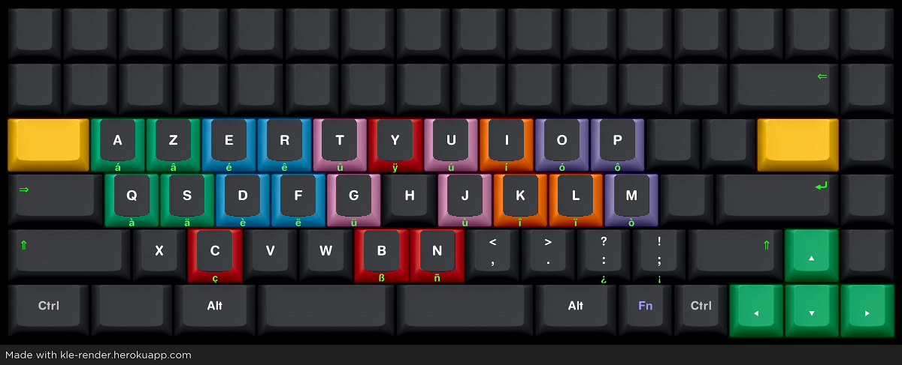

Or just the front

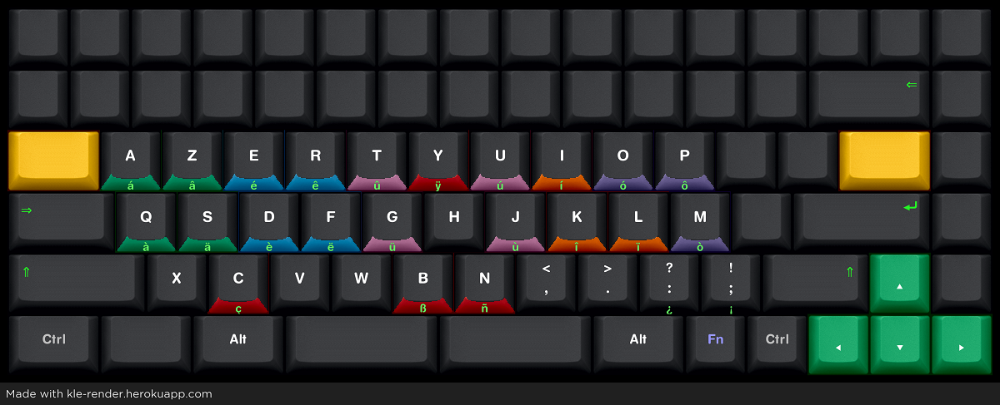
  

## 3. How to color and add characters on keys?

- Order keys from a mechanical keyboard retailer
- Clear or Translucent keycaps, paint, sratch, then varnish
- Ink and laser pointer
- Paint or acrylic markers then varnish
- Thermal transfer
- Classic transfer and strong glue
Avoid stickers

Fluorescent paint possible if not using backlight
  

## 4. Full template

Now it's time to complete what we do with the normal keys and with the yellow keys.
- The ?/ key is now ?: and the :; is now !; much more practical and easy to remember.
- Also the character / becomes alone that we place with \ to the left of the yellow key, this also has another use which I will explain
- With these keys we do the + and the minus, if you are not a programmer or you use them more often than /\ you can invert the top and bottom.
- The -_ key therefore becomes the -= key, more practical because closer to the shift, the _ is made by pressing the yellow key twice, it is very feasible thanks to the dead keys.
- the {[ }] keys are placed on the top line next to special characters, notably braces, and each is a very useful, with visual and associative logic of which finger to do it.
- Yellow keys do the numbers and extremely memorizable associative characters. I don't complete others letters, as it would be break the template if someone do another positionnement for the accents.

Of course it's as you wish, but personally for this project, I'm going to keep this common basis, it's the use or not of the yellow keys and the position of the accents to which I would leave more freedom.

Note that the numpad has no other functions, which is why I put the Play/Pause key instead of the Numlock, this avoids unpleasant surprises.

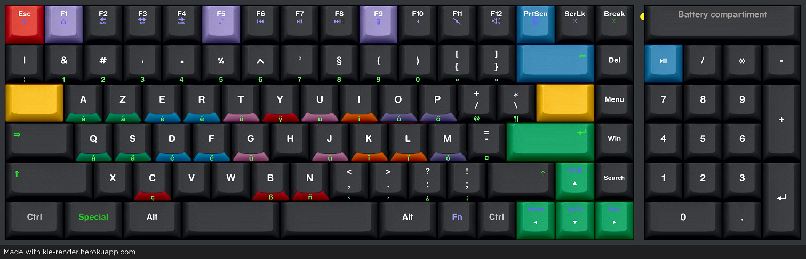

If it's 75%, the numbers have to be done with shift, or even reverse up and down if you're not a programmer and you use them really often.
- But I don't replace what the yellow key can do, so as not to create too big differences between the two sizes, you can for example have a small one in the bag and a large one at home. I would keep the same idea in mind if I did a 60%.

Apart from that, that's all, except that I keep the Play/Pause key and therefore combine the Win key and the Search key.

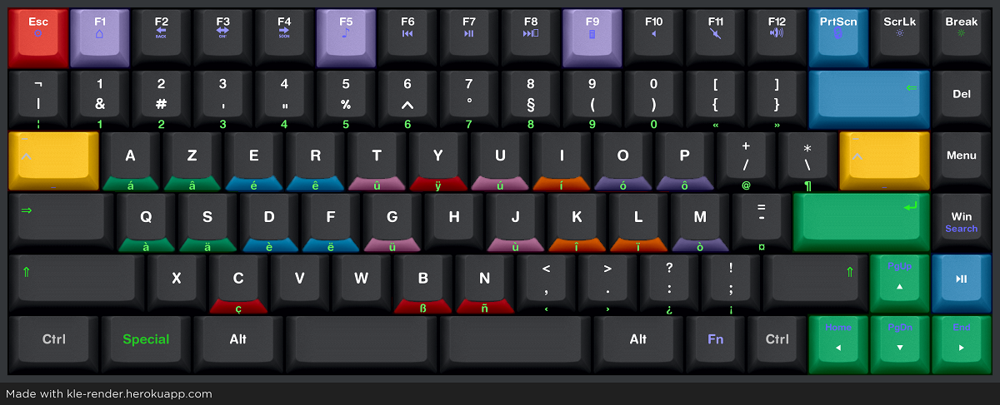

Alternatively you can consider doing the accents differently, ignoring the acute and grave; by placing it differently, or putting others, more useful, in your language; and place the acute and grave symbols to the left of the yellow key.

In this case the / and \ are done by double pressing, which is still nice to do for these characters, as the _ is done by double pressing the Yellow key.

You can think of ignoring to use a yellow key or use it to do ^ accents only, for example. With or without using colors, directly on the good letter.

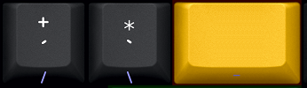
  

## 5. What about the special key?

You seen I've moved win key to the left, so why?

Well, if I don't use a Mix, it's to indirectly take advantage of the additional key VK_OEM_102 of the ISO. I place this key instad of Win as a dead Key.

I have another solution to quickly use a list of many characters; I'll tell you how later; Also, the characters I'll do with, will be more useful than others or series, and easy to remember using the associative method too. It is not useful to override, as for the yellow keys, it is easier to keep a simple layer and not to add combinations with with Shift or Control. But you can think of it, for example, if you need a layer of Greek.

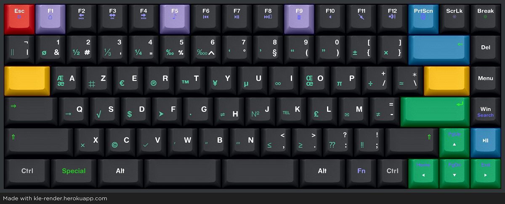

Remember, except if you juge it necessary, we don't put them on Keycaps, nor Green (special) nor Yellow (accents). Or at the Front, possibly, accents at the front center, special characters at the front left.
  

## 6. And how can I write the accents themselves?

Two choices, either use the system I'm going to talk to you about later, to type lists of characters easily, or use the control key.

CTRL should not be used on letters and numbers, but why not on OEM characters.

And given the layout I used, it will be easier than those who tell you to use the ALTGR key with characters drawn here or there, for memotechnical means.

This gives:

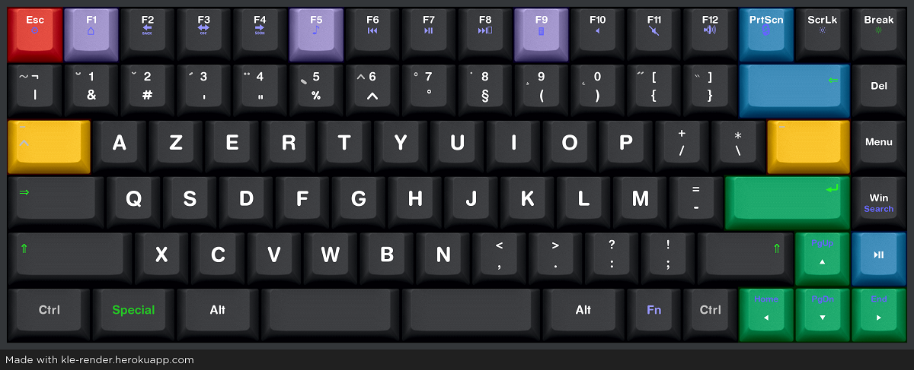

We treat them like Dead keys too.
- This means that you can write any accented letter, by doing CTRL(+Shift)+Accent+Letter.
- Or write just the desired accent, by doing CTRL(+Shift)+Accent+Accent
- Ligatures for fonts which support them are achieved by doing CTRL(+Shift)+Accent+Space
- Special+Special Unbreakable space
- Special+Space Zero Width Space
- Yellow+Yellow Underscore
- Yellow+Space Thin Space

| CTRL + | SHIFT + | Key + | Name         | Keys                      | Gives :                    | Ligature |
|:------:|:-------:|:-----:|:------------:|:-------------------------:|:--------------------------:|:--------:|
|   ✓    |    ✕    | /+    | acute        | aceilnorsuyz ACEILNORSUYZ | áćéíĺńóŕśúýź ÁĆÉÍĹŃÓŔŚÚÝŹ´ | U + 0301 |
|   ✓    |    ✕    | \\*    | grave        | aeiou AEIOU               | àèìòù ÀÈÌÒÙ`               | U + 0300 |
|   ✓    |    ✕    | Yow   | circumflex   | aceghijosu ACEGHIJOSU     | âĉêĝĥîĵôŝû ÂĈÊĜĤÎĴÔŜÛ^     | U + 0302 |
|   ✓    |    ✓    | /+    | diaeresis    | aeiouy AEIOUY             | äëïöüÿ ÄËÏÖÜŸ¨             | U + 0308 |
|   ✓    |    ✓    | \\*    | tilde        | aionu AIONU               | ãĩõñũ ÃĨÕÑŨ~	              | U + 0303 |
|   ✓    |    ✓    | Yow   | macron       | aeiou AEIOU               | āēīōū ĀĒĪŌŪ¯               | U + 0304 |
|   ✓    |    ✕    | -=    | breve        | agu AGU                   | ăğŭ ĂĞŬ˘                   | U + 0306 |
|   ✓    |    ✕    | ,<    | cedilla      | cgklnrst CGKLNRST         | çģķļņŗşţ ÇĢĶĻŅŖŞŢ¸         | U + 0327 |
|   ✓    |    ✕    | .>    | dot          | acegiluz ACEGILUZ         | åċėġıŀůż ÅĊĖĠİĿŮŻ˙         | U + 0307 |
|   ✓    |    ✕    | :?    | ogonek       | aeiu AEIU                 | ąęįų ĄĘĮŲ˛                 | U + 0328 |
|   ✓    |    ✕    | ;!    | caron        | cdeilnrstz CDEILNRSTZ     | čďěǐľňřšťž ČĎĚǏĽŇŘŠŤŽˇ     | U + 030C |
|   ✓    |    ✕    | {[    | double acute | dout DOUT                 | ðőűþ ÐŐŰÞ˝	              | U + 030B |
|   ✓    |    ✕    | }]    | ring         | dhilot DHILOT             | đħijłøŧ ĐĦIJŁØŦ˚             | U + 030A |
  

## 7. And technically, how do I do?

Ok, I take a practical case

we start with this:

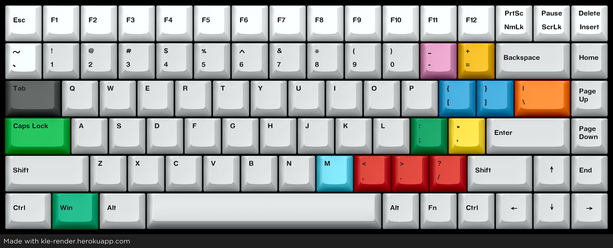

The first thing to do is to physically move the keys, not immediately change the layout.

Why? Quite simply because, for example, games see the keys in raw mode (or DirectInput etc.) and not the layout; also, if the keys no longer correspond at all to what the old ones represented, you risk being lost or very confused.

How to do? Either with the supplied software, if the keyboard allows it, or by flashing the rom with software like VIA or QMK on mechanical keyboards, or with software like Sharpkeys for example, which allows you to modify the registry so as to exchange or reassign the keys and not change layout.

I will give an example for sharpkeys.

Thinking about this, which model is closest to what we wanted, which will allow us to memorize the keys, despite the new layout.

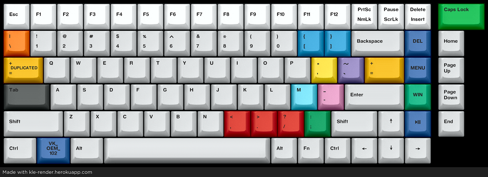

- The keys [{ and ]} are almost the same as {[ }] we wanted
- The keys '" and /+(´¨) are really close
- The keys `~ and \*(`~) are really close
- The keys \| and |¬ are almost identical
- The keys -_ and -= are almost identical
- The change between /? and :? keys is easy to remember
- The change between ;: and ;! keys is easy to remember

So it will be easy to identify the key in a game or whatever

Well, to program this, we need to know by making a list, what we changed and for what, or just reassigned:

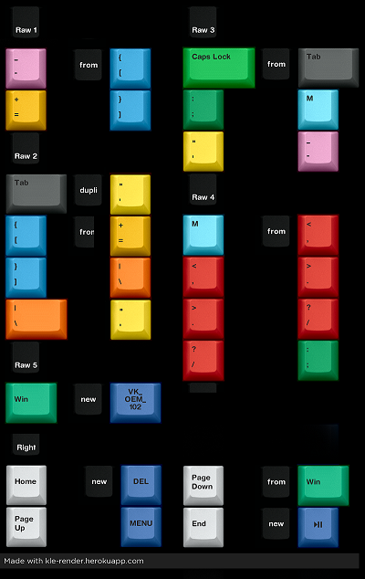

No need to follow the route, just which one and by what.

Then, for example, the first one:
- Open SharpKeys
- Click Add
- Select or type Key: `~ (00_29) under 'Map this key'
- Select or type Key: \| (00_2B) under 'To this key'
- Click 'OK'
- Check that it has been added to the list and that it is the correct assignment
- Click 'Write to Registry' and valid 'OK'
- LogOut/ReLog
The Key `~ should act now like \|, not the characters, it will be detected as a raw \| key, then we can change characters, it will stay detected as it is.

If we do the complete list, it gives:

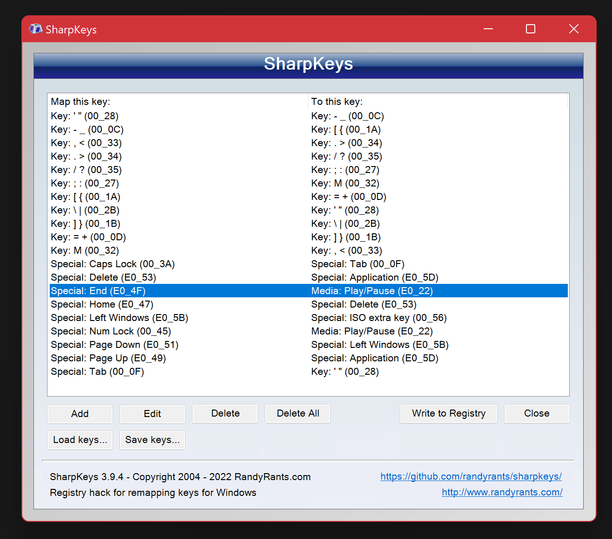

Of course a fully reprogrammable keyboard is preferable, but it remains a viable solution on his workstation with another keyboard for example, or for tiny budget.

Don't worry about loops, only the original keys are reassigned. Changes will not affect an already reassigned key.
  

## 8. And for the layout?

Two choices, either use Autohotkey for both Yellow and Special keys, or use the keyboard layout creator or anything like it. You will find many examples and tutorials.

The advantage of Autohoykey is to not depend of any dead key, so no suprise; the inconvenient is, you have to stay pushed on first key before doing the second one. It's up to you.

But I will provide a example of layout, the one I'm talking about in this article, and Autohotkey script, that you can add to the solution I'll talk later.

If you absolutely want to use characters on ALTGR, without having to sacrifice RALT for ALTGR and manually type LEFT CONTROL + RIGHT ALT (Which is a good way to keep keys safe since the combination is hard to make by chance), normally it is impossible because as soon as placed, a character on the altgr layout, it locks the template to replace RALT, and it is not possible to unlock it manually.

But there is a trick.
- Continue until the end, save your template regularly, then compile it as is.
- Once done, in the installation directory go to the directory that corresponds to your machine, or else, do it for all.
- Open the dll you find there with a hex editor.
- Look for 01 as in the image below (the group that contains it, which can be seen in the image, is easily identifiable; even if the whole file may be different)
- Change it to 00 then save.
- And only now proceed with the installation using the msi from the root directory.

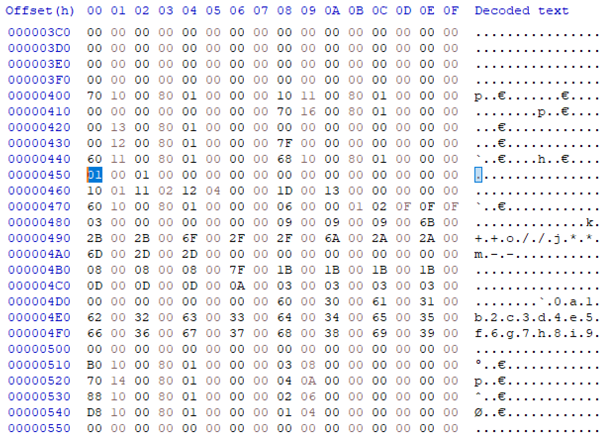

Normally if everything went well, the RALT key is not modified, but you can use LCTRL + RALT to enter the characters corresponding to this layout.
  

## 9. And the solution you talked about for typing lists of charcters easily?

I made a separate project, so it will be easier:  
RALTUnicode  
https://github.com/ytyra/RALTUnicode

You can add Autohotkey example for Yellow and Special keys, in this project, by copying assocations of keys under the section Miscellaneous.

It is also possible to use Autohotkey so that if you keep pressing on a colored key, it makes the desired accent instead of the letter, remaining accessible with a short press. On the other hand, care must be taken to do this on all the letters, because otherwise there would be a time lag (the time to check for Autohotkey whether it is a single or double letter) which could reverse certain letters in the short of your typing. This lag is not important for a game, for example, because the games see the keys in raw mode, DirectInput etc. and not the letters themselves.
  

## 10. Tests

It works as expected, it's simple and fun, I also use the Autohotkey method by long press, but keep this one together, to eventually do it with a reprogrammable keyboard and for example a tablet on which I cannot use the script. Haven't done the painting yet, and hesitate to do it or wait for a next QMK compatible firmware mechanical keyboard that suits me.
  

## Related links and source

KLE:  
http://www.keyboard-layout-editor.com

KLE-Render:  
https://kle-render.herokuapp.com

QMK Firmware:  
https://qmk.fm

VIA:  
https://www.caniusevia.com

Physical Keyboard Layouts Explained In Detail:  
https://drop.com/talk/947/physical-keyboard-layouts-explained-in-detail

The frequency of the letters of the alphabet in English:  
https://www3.nd.edu/~busiforc/handouts/cryptography/letterfrequencies.html

US Multilingual Keyboard Layout:  
https://www.brianhetrick.com/kb
