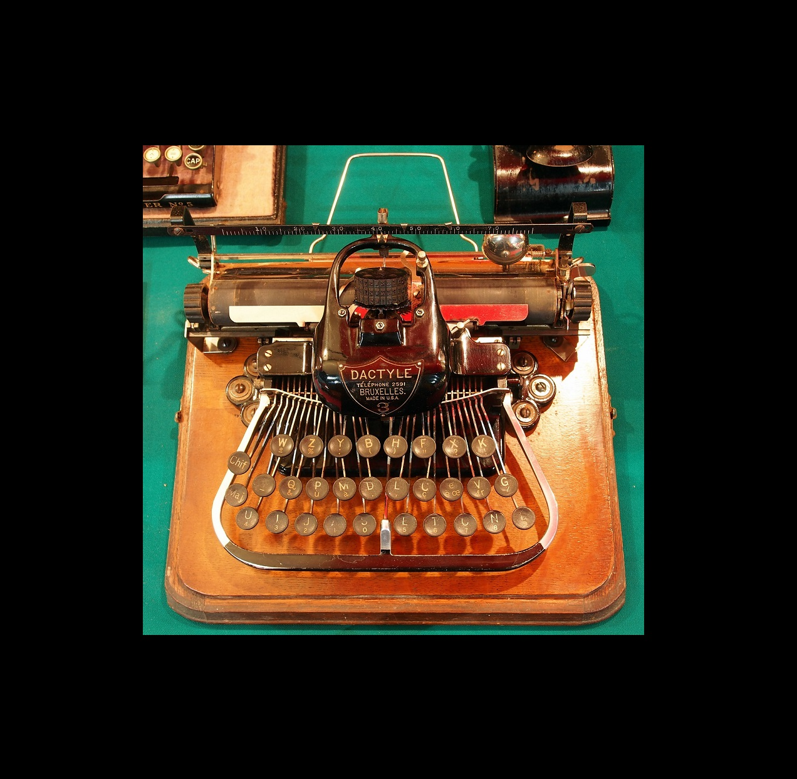
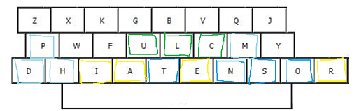
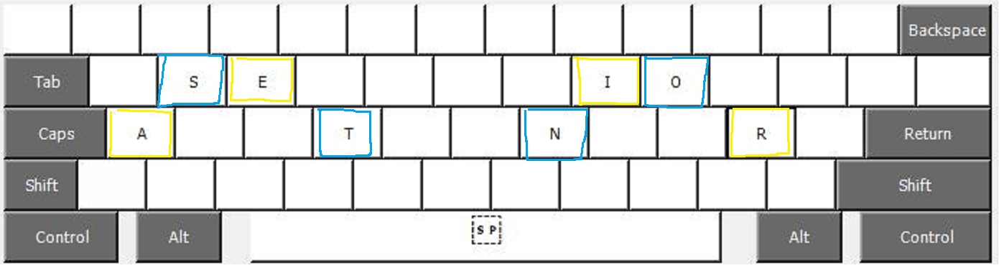
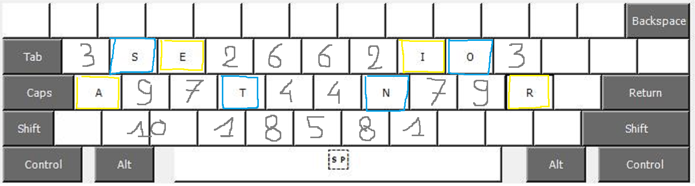
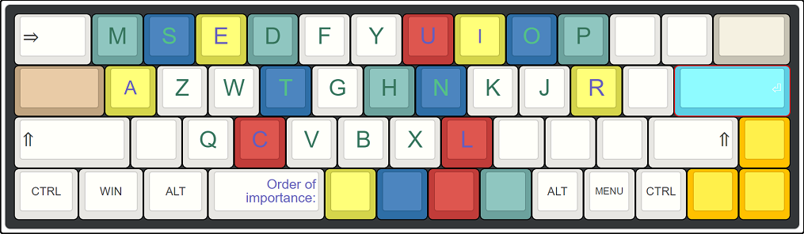
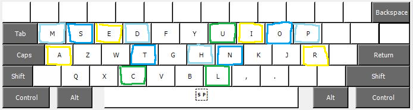
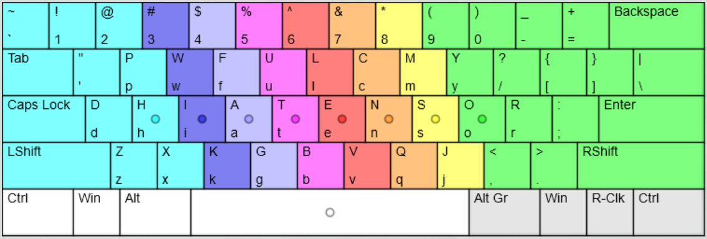

# DIY-US-INTL-Keyboard
Not revolutionary, but a much easier way to arrange an international layout on US keyboard than usual solutions. Especially for programmers.

I will complete the project step by step

## The story:

When inventing the Morse code, Samuel wondered what were the most used letters in order to match the alphabet to the code, the simplest for the most used. Then for the hesitations between two, the most visual, association of form or idea, simple memotechnical means.
These are the basics of mechanical writing. And this is what we are going to try to find, where we got lost, keeping this essential in mind and trying to avoid the pitfalls of other solutions that seem to be advantageous. And find there a certain joy of living without contradiction with efficiency.

Historically, this would have gone something like this:

--------------------DHIATENSOR.jpg

If I add in 4 colors the most used letters, it gives this:

We see that to avoid distances, the letters were grouped on the same side, then, the least important of the most important, on the left, next to the capitals keys.
Of course in other languages, the letters FGB for example are more used, but overall the classification remains the same.
Now let's put them in order of importance, on a newer machine keyboard that requires less keystrokes and space, ergonomically; yes, we come from there; therefore eight fingers placed in a rounded shape on the middle line of the layout.

Which fingers are the most significant for each letter, balance of importance, ideas: the words east and noir.

Now the ease of access, to associate with which side for each pair (letter rather analytical or letter rather synthetic or balance) and to the order of importance of the letters, which is: EARIOTNSLCUDMPHGBFYWKVXZJQ

- Nowadays perhaps MP and HG would be interchangeable given that there is less space to cover and therefore less intellectualization of a vertical line change compared to a somewhat difficult finger advancement.
- This is the first draft of the qwerty/qwertz/azerty we know, some say one is scientific, the other universal, that's wrong, both are scientific and universal, the difference just depends on how the machine, and the need to adapt to avoid fatigue.

- The problems: (yes, we made this mistake again later) rather than punctuation and accentuation keys being on the same keys as the letters, we wanted them independent and easy to access, at least for the comma; the point only being placed at the end of the line. So the comma instead of the L and the point to its right. Also we could transfer the little used X to the other side before the even less used Q.

Now all that remained was to make a weight balance and lighten the sentences, because there, it gave the impression that each letter had a break before the next.
!!!! WE CAN CONSIDER this research for later when we are sure that our keyboards are fully programmable and can be used on any device without having to put a layout template file (which requires admin rights ) or whatever else to get it to work properly, because the whole layout is a heavy thing to swap out.
In the meantime, I will rather dwell on other errors that have been made, and see if there are no other solutions than those usually proposed and which come out of the controversy.

But first, crack the polemic, explain its impacts, then move on:

some consciences,

Rather than making a comic of it, and leaving the fights to simple confrontations, which (, if we are not in need, which should not have been the case apart from surviving, all, on this planet) was only a game, which should have stopped depending on the consequences (with a little wisdom or cold blood and not after 400,000 years of butchery),

Invent wars, for the entities, as serious vs humor, rather than a war in a comic strip, it's interesting, we have fun with it as we don't, we play it, while they are simple contradictions for the human. And we find ourselves almost forced to accept that they exist, and with that peace (yes, if you don't want war to exist as a real concept, it's because you believe it exists and you flee her in peace) and with that the emancipation and with that the relentlessness that would project a war on her that would remain only hers, yes, the war, a simple idea, apart from the consequences.

Which means that in the fun of the "morons" who would project according to some who speak of others, who exist for those, who are for them, free from what did not exist, to make war, peace, to laugh, to make others project, are in their sprinkler mirror sprinkled, to go with the theme of the first typewriters in Chaplin's time; rather again, it's the content of a comic book; well it turns out that to believe themselves free, the serious ones rage with their own fun on them to want to reinvent the wheel again and do better than what we had for which they would be responsible for its destruction.

And so,
The F and T are exchanged according to the pi law of contradictions
The R is removed from the word 'NOIR', The T is spaced from the word 'EAST'
Some countries have shifted the comma, by lowering a letter, that of the little finger of the right hand, and surely the serious will explain in a fable by LaFontaine why it is not good for the monkey who played a trick on it.
And the swap between L and N which isn't a bad idea, regrouping HJKL; place J, letter little used instead of N or L which were much more so.
etc

On the other hand, the monotony is well broken, and the phonetics of the lines, easy to remember.

Not being here for this controversy, it is not mine and does not belong to me, moreover, to whom in fact?,
I'm not saying that to do it, but that it won't be my subject, I'll do something else.
Which will therefore be: How to keep the current layout, apart from simple changes concerning the letters. How to remodify small errors such as the comma instead of M. How to make innovative and simple, but not revolutionary nor fun to reinvent the wheel, changes to accented characters. What a simple and effective placement concerning the other characters, and with what tools.

## Issues:

- And the current international US keyboard?

It has two major shortcomings, one it introduces the ALTGR key, which replaces the RIGHT ALT, which is not good for programmers or other trades; two, it causes an inability to simply use certain essential keys like ' or ".

- Anyone else built layouts based on the US International?

They use for example ALTGR to change ' (which therefore remains pleasantly usable) to make it an alternate key which works like on the unmodified international layout. But it's too complicated, still uses the right ALT key, and wants to adapt to all languages, which even if perfectly organized is a catch-all; rather than each doing their own, in a common idea to share and develop.

- And other famous layouts, Dvorak, Evolved, Capewell, Colemak, QFMLWY, QGMLWY, Norman, Arensito, Neo etc?

Precisely, for what is the template of a country, I am looking for more fun and simpler, and modifiable by everyone according to their wishes, without contradicting the effectiveness of the base.
As for the others, they reinvent the wheel in a fake fun, which does not advance much otherwise el do, because rather than presenting each his own, it was enough to go back to the last stage of the current keyboard and make something of it. 'other. Basically, they want you make do this:

That is to say, that the base having been used for the development of the QWERTY, it is placed on the QWERTY in an inappropriate way since this was done for machines having a lot of space between each key and requiring a lot of force to typing, which is not the case with our keyboards, which therefore deserve a layout that stems from it and not a layout that reinvents it where it is not suitable. On the other hand, a keyboard resembling a typewriter, there are some magnificent ones today.

That's why I'm not going to do it, I'll wait for fully reprogrammable keyboards without wandering in autonomy, then I'll do my own. But if some people do it for themselves, and they like it, or some people do it in a global way without trying to reinvent the wheel, so much the better for them. Only it remains hard to pass from a computer which is el soien to one which is not.

- What about mechanical keyboards?

They do the job. The layout shouldn't be the essence of what they represent; they are part of a nice style like any other, but with the ability to be fully regrammable in the future, with less impact (ability to be wireless if needed, great autonomy etc.). They will not be the only ones, so they represent a fashion, viable in the long term, but not a solution to a problem, what is ergonomics, efficiency and simplicity, regardless of the choice of type of keyboard, with each one's preferences, and not the keyboard type is the solution.

## Disclaimer:
I don't have a budget, so the example will be basic, but it's the idea that counts, afterwards, everyone adapts if they want.
But I will provide software solutions

## 1. The choice of the keyboard
to be continued...
